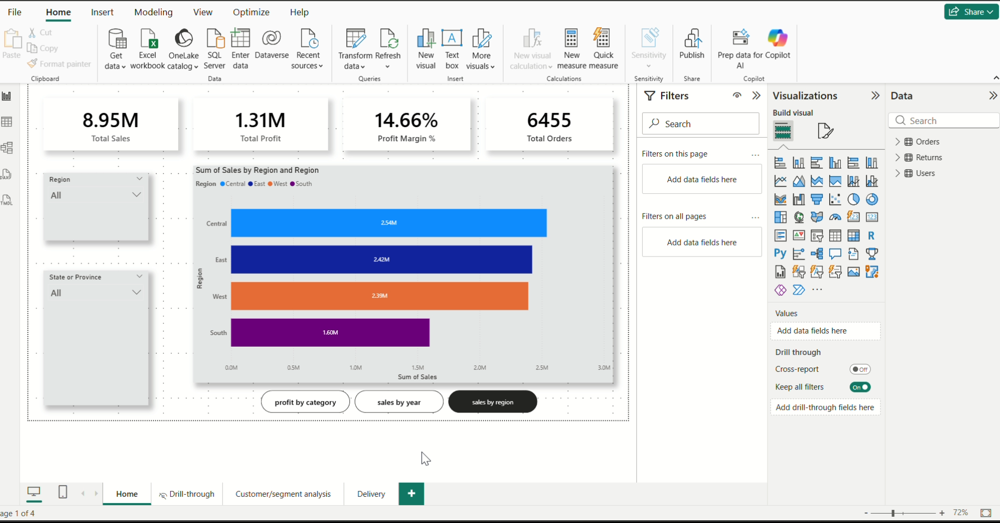
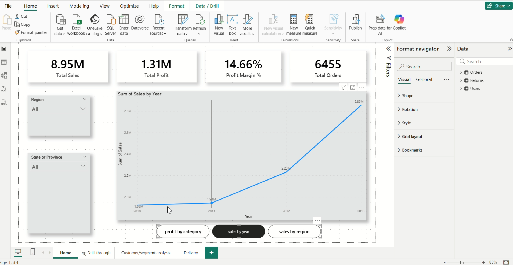
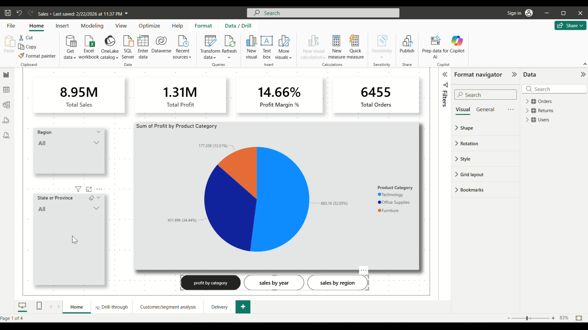
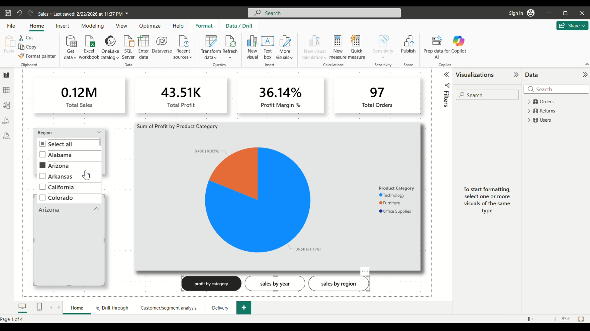
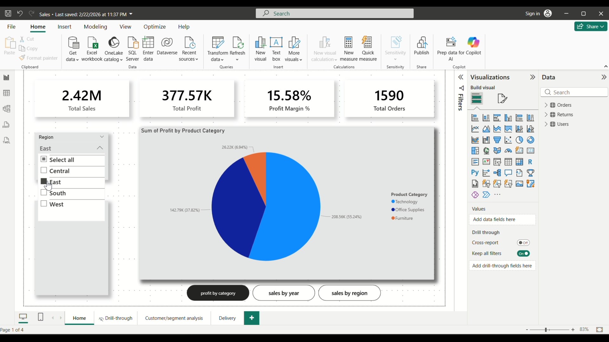
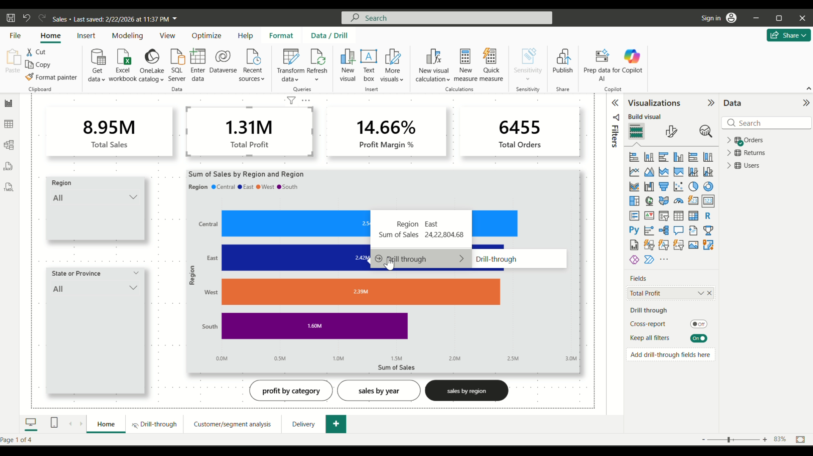
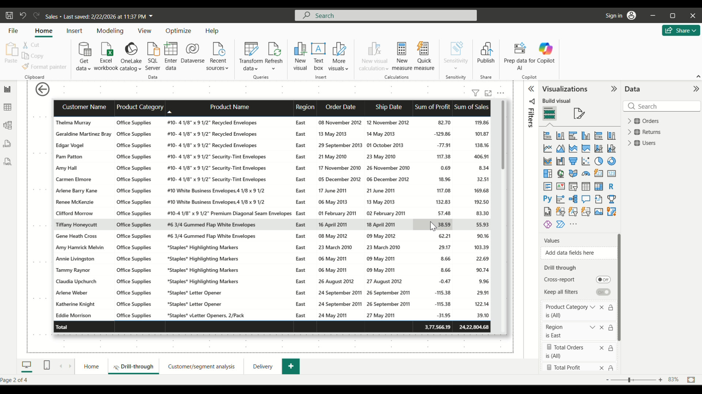
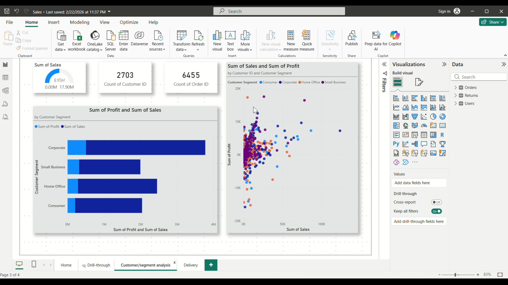
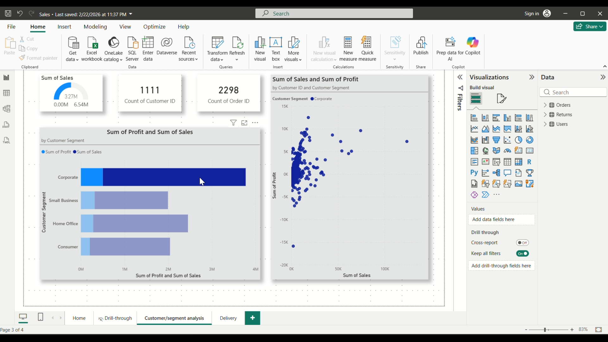
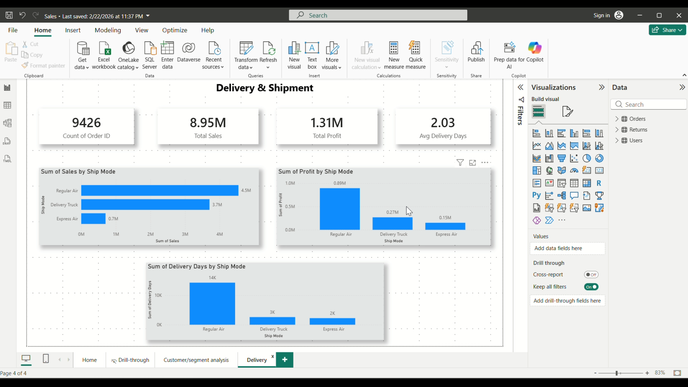

# 📊 Sales Analytics Dashboard — Power BI

> A 4-page interactive sales dashboard analyzing retail performance 
> across regions, product categories, and customer segments.

---

## 🖼️ Dashboard Preview

---

## 📌 Project Overview

Built this dashboard to practice and demonstrate end-to-end Power BI 
development — from raw Excel data to a fully interactive business report.

**Pages included:**
- **Home** — KPIs + 3 chart views with bookmark toggles
- **Drill-through** — Transaction-level detail per region
- **Customer/Segment Analysis** — Profit & sales by customer type
- **Delivery & Shipment** — Ship mode performance analysis

---

## 📈 Key Business Metrics

| Metric | Value |
|---|---|
| Total Sales | 8.95M |
| Total Profit | 1.31M |
| Profit Margin % | 14.66% |
| Total Orders | 6,455 |
| Avg Delivery Days | 2.03 |

---

## ✨ Features Built

- KPI cards for instant business snapshot
- Bar chart — Regional sales comparison (Central, East, West, South)
- Line chart — Year-over-year sales trend (2010–2013)
- Pie chart — Profit by Product Category
- Scatter plot — Sales vs Profit by Customer Segment
- Gauge chart — Sales performance indicator
- Bar/Column charts — Ship mode analysis (Sales, Profit, Delivery Days)
- Slicers — Region + State/Province with cross-filtering
- Drill-through — Region bar → detailed transaction table
- Bookmarks — Toggle between 3 chart views on Home page
- DAX measures — Profit Margin %, Total Sales, Total Profit

---

## 🖼️ All Screenshots

| Page | Preview |
|---|---|
| Home – Sales by Region |  |
| Home – Sales by Year |  |
| Home – Profit by Category |  |
| Slicer – State Filter |  |
| Slicer – Region Filter |  |
| Drill-through Trigger |  |
| Drill-through Detail |  |
| Customer Segments |  |
| Corporate Filter |  |
| Delivery & Shipment |  |

---

## 🗂️ Data Source

- Format: CSV
- Tables: Orders, Returns, Users
- Records: 9,426 orders
- Period: 2010–2013
- Domain: Retail / E-commerce

---

## 🛠️ Tools & Technologies

| Tool | Usage |
|---|---|
| Power BI Desktop | Dashboard development |
| DAX | Custom measures & calculations |
| Power Query | Data cleaning & transformation |
| CSV / Excel | Data source |
| GitHub | Project hosting & portfolio |

---

## 📁 Repository Structure
sales-analytics-powerbi/
├── Sales.pbix               # Power BI project file
├── sales_data.csv           # Source data
└── screenshots (in root)    # All dashboard screenshots

---

## ▶️ How to View This Dashboard

1. Download `Sales.pbix` from this repo
2. Open it in **Power BI Desktop** (free — download from microsoft.com)
3. All visuals, slicers, and drill-throughs will work fully

> This project uses Power BI Desktop only. No Power BI Service account needed.

---

## 👤 About Me

**Shikhar Agnihotri**
MCA Graduate | Aspiring Power BI Developer & Data Analyst
📍 Open to opportunities

[🔗 LinkedIn](https://www.linkedin.com/in/shikharagnihotri) •
[💻 GitHub](https://github.com/Shikhar2001)
